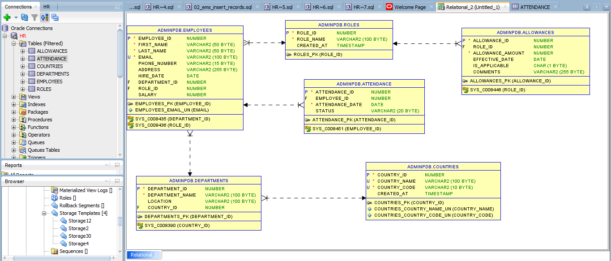

# Employee Management Database (Using Oracle as RDBMS)

This README provides an overview of the Employee Management Database, designed specifically for Oracle courses to manage and store information related to employees and organizational structure. It includes tables for Countries, Departments, Roles, Managers, Employees, Allowance, and Attendance records.

## Table Structures

### Students Table

```sql
CREATE TABLE Students (
    student_id INT PRIMARY KEY,                 
    first_name VARCHAR(50),                     
    last_name VARCHAR(50),                      
    email VARCHAR(100),                         
    enrollment_date DATE                        
);
```

## Teachers Table

```sql
CREATE TABLE Teachers (
    teacher_id INT PRIMARY KEY,                  
    first_name VARCHAR(50),                     
    last_name VARCHAR(50),                      
    subject VARCHAR(100),                       
    email VARCHAR(100)                         
);
```

## Classes Table

```sql

CREATE TABLE Classes (
    class_id INT PRIMARY KEY,                   
    class_name VARCHAR(100),                    
    teacher_id INT,                            
    start_time TIMESTAMP,                       
    end_time TIMESTAMP,                         
    room_number VARCHAR(20),                    
    FOREIGN KEY (teacher_id) REFERENCES Teachers(teacher_id) 
);
```

## Registrations Table

```sql
CREATE TABLE Registrations (
    registration_id INT PRIMARY KEY,            
    student_id INT,                             
    class_id INT,                               
    registration_date DATE,                     
    grade CHAR(2),                            
    FOREIGN KEY (student_id) REFERENCES Students(student_id), 
    FOREIGN KEY (class_id) REFERENCES Classes(class_id)       
);
```


# Inserting Records

To insert records into the tables, you can use the following examples:

## Insert Students

```sql
INSERT INTO Students (student_id, first_name, last_name, email, enrollment_date) VALUES 
(1, 'John', 'Doe', 'john.doe@example.com', TO_DATE('2024-01-15', 'YYYY-MM-DD'));

INSERT INTO Students (student_id, first_name, last_name, email, enrollment_date) VALUES 
(2, 'Jane', 'Smith', 'jane.smith@example.com', TO_DATE('2024-02-20', 'YYYY-MM-DD'));

```

## Insert Teachers

```sql 
INSERT INTO Teachers (teacher_id, first_name, last_name, subject, email) VALUES 
(1, 'Alice', 'Williams', 'Mathematics', 'alice.williams@example.com');

INSERT INTO Teachers (teacher_id, first_name, last_name, subject, email) VALUES 
(2, 'Robert', 'Taylor', 'Science', 'robert.taylor@example.com');
```
## Insert Classes

```sql
INSERT INTO Roles (Role_Name) VALUES ('Manager');  -- Inserting Manager role
INSERT INTO Roles (Role_Name) VALUES ('Employee');  -- Inserting Employee role

```

## Insert Employees

```sql
INSERT INTO Employees (First_Name, Last_Name, Email, Phone_Number, Address, Hire_Date, Department_ID, Role_ID, Salary)
VALUES ('Alice', 'Kanayana', 'alice@example.com', '+250788123456', 'Kigali, Rwanda', SYSDATE, 1, 1, 50000);  -- Inserting employee Alice
```

## Insert Attendance

```sql
INSERT INTO Attendance (Employee_ID, Attendance_Date, Status) VALUES (1, SYSDATE, 'Present');  -- Attendance record for employee Alice
```

## Conceptual, Logical and Physical Data Model



## Conclusion

This Employee Management Database schema is provided for educational and development purposes. You are free to use, modify, and distribute this code as you see fit, provided that proper attribution is given.

### License

This project is licensed under the [MIT License](https://opensource.org/licenses/MIT). You can freely use, copy, modify, and distribute this software, but please include a copy of this license in any distributions.
